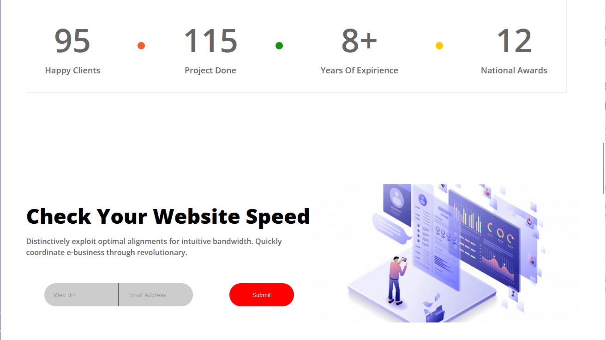
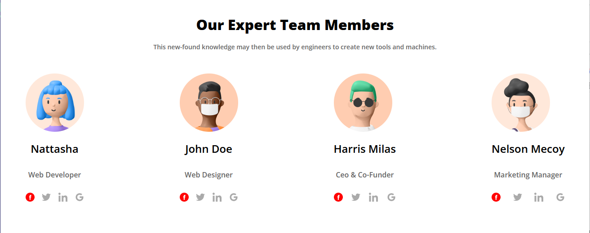
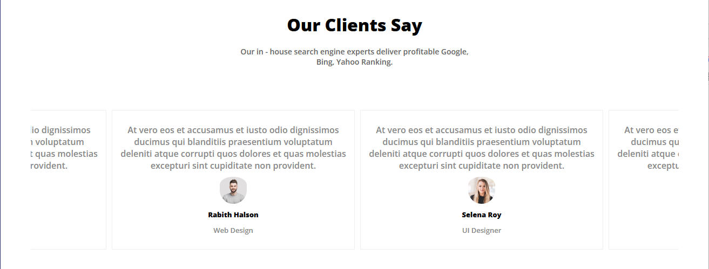

# Основы веб-верстки HTML/CSS
## Урок 9. Семинар. Основы позиционирования

### Задание:

Мы продолжаем работать с проектом из прошлого урока [https://www.figma.com/file/mnLY69cYE5cqWM5w6n5hXx/Seo-%26-Digital-Marketing-Landing-Page?node-id=186%3A47](https://www.figma.com/file/mnLY69cYE5cqWM5w6n5hXx/Seo-%26-Digital-Marketing-Landing-Page?node-id=186%3A47)

**В данном домашнем задании мы будем добавлять стилистику и позиционирование для следующего блока сайта**

1. Добавить весь контент из макета.

2. Ко всем элементам контента добавить классы.

3. Добавить стили для всего контента сайта.

4. Расставить элементы в соответствии с макетом.

### Решение

Решение представлено в текущей папке. Корневой файл - [index.html](index.html)

### Результат работы:

